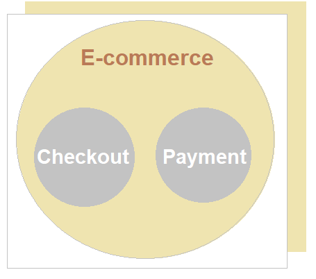
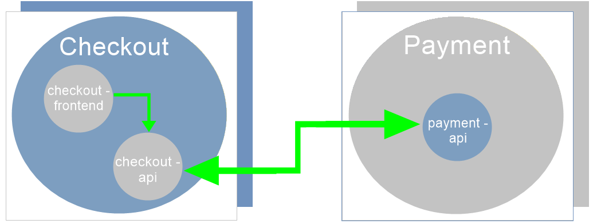

<h1 align="center">
    <a href="https://github.com/Fernanda1701/e-commerce-project">Projeto E-commerce com microsserviços em Java 🛍️</a>
</h1>

API de e-commerce desenvolvida em aula

<h2 align="center">

</h2>

## 💎 Sobre

O projeto foi desenvolvido com dois domínios, sendo eles: <b>Checkout</b> e <b>Payment</b>, como ilustrado na imagem abaixo:

<h3 align="center">Domínios</h3>

  

O <b>Checkout</b> é reponsável por guardar todas as informações do usuário como:

- First Name;
- Last Name;
- E-mail;
- Address;
- Complement;
- Country;
- State;
- Cep;
- Payment Method;
- Card Name;
- Card Number;
- Card Date;
- Card Cvv;
- Lista de Products;

Já o <b>Payment</b> é responsável por fazer a cobrança da compra.

## 🏗️ Arquitetura

Foram criadas duas APIs, a checkout e a payment, que consomem-se entre si, possuindo o Kafka como broker e um front-end que consome apenas a API checkout:

<h3 align="center">Arquitetura</h3>

  

O consumo funciona como no seguinte esquema:

- checkout-frontend → checkout-api → Kafka → payment-api

## 🛠 Tecnologias
 
- Aplicação inicializada com [Spring Initializr](https://start.spring.io/)
- [Java](https://www.java.com/) 14
- [Gradle](https://gradle.org)
- [Spring Boot](https://spring.io/projects/spring-boot) 2.3.1.RELEASE
- Versionamento de código no [GitHub](https://github.com/)
- [Docker](https://www.docker.com/)
- [PostgreSQL](https://www.postgresql.org/)

### Dependências:

- [Spring Data JPA](https://spring.io/projects/spring-data-jpa)
- [Spring Web](https://docs.spring.io/spring-framework/docs/current/reference/html/web.html#spring-web)
- [Spring DevTools](https://docs.spring.io/spring-boot/docs/1.5.16.RELEASE/reference/html/using-boot-devtools.html)
- [Spring Test](https://docs.spring.io/spring-framework/docs/current/reference/html/testing.html)
- [Lombok](https://projectlombok.org/)
- [Sleuth](https://spring.io/projects/spring-cloud-sleuth) 
- [Cloud Stream](https://spring.io/projects/spring-cloud-stream)
- [Apache Kafka Streams](https://kafka.apache.org/documentation/streams/)
- [Avro](https://avro.apache.org/)

## 💻 IDE

IDE utilizada: [IntelliJ](https://www.jetbrains.com/pt-br/idea/)

## Autor:

<a href="https://github.com/Fernanda1701">
 
  
 <b>Fernanda Nascimento</b></a> 

Entre em contato ✉️:

